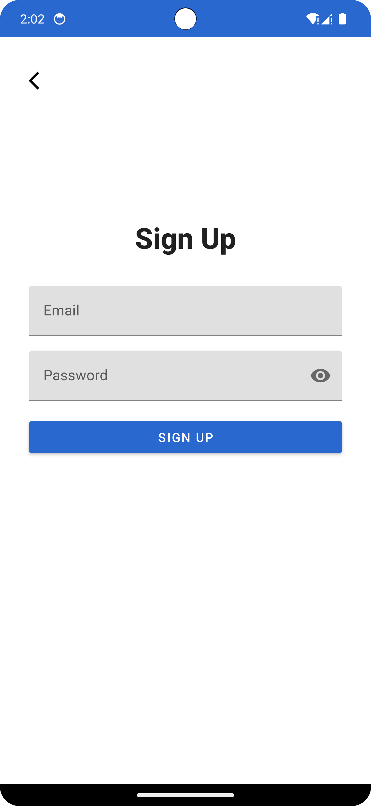

# My To-Do List App

Welcome to my To-Do List app repository! This app allows users to manage their tasks effectively, including adding, viewing, updating, and deleting tasks. Users can sign up or sign in with Google authentication and maintain their own personalized to-do lists.

## Features

- User authentication with Google Sign-In.
- Add new tasks with name, description, due date, and completion status.
- View all tasks or filter tasks by completion status.
- Update existing tasks.
- Delete tasks from the list.
- Profile management with additional information beyond basic authentication.

## Add Functionality

### How it Works

The add functionality allows users to add new tasks to their to-do lists. When a user clicks on the "Add Task" button, they are presented with a form where they can input details such as the task name, description, due date, and mark the completion status. After filling out the form, the user submits it, and the task is added to their list.

### Working

1. Click on the "Add Task" button to open the add task form.
2. Fill out the form with the required task details.
3. Optionally, mark the task as completed by ticking the completion checkbox.
4. Click on the "Submit" button to add the task to your list.

## Screenshots

## Installation

To run the app locally, follow these steps:

1. Clone the repository to your local machine.
2. Open the project in Android Studio.
3. Connect your device or use an emulator.
4. Build and run the app.

## Technologies Used

- Android Studio
- Kotlin
- Firebase Authentication
- Firestore Database
